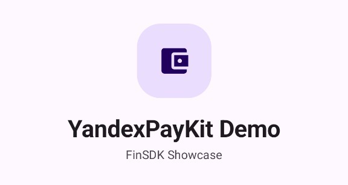
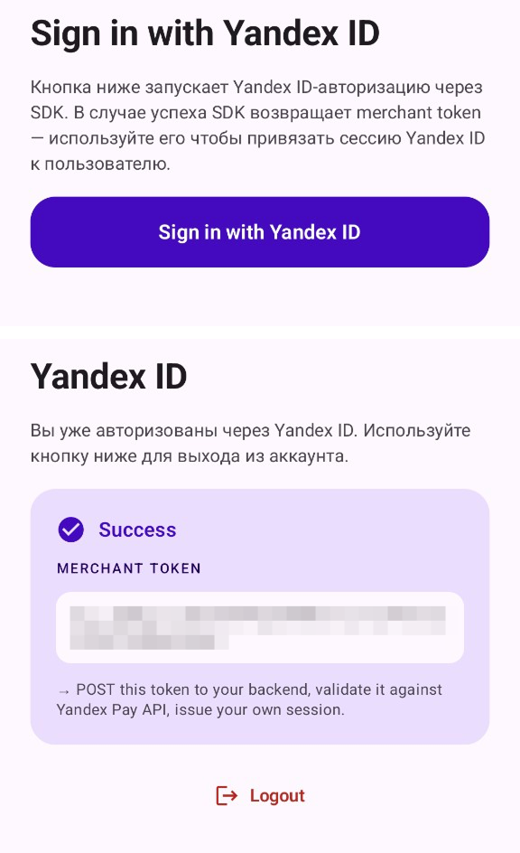
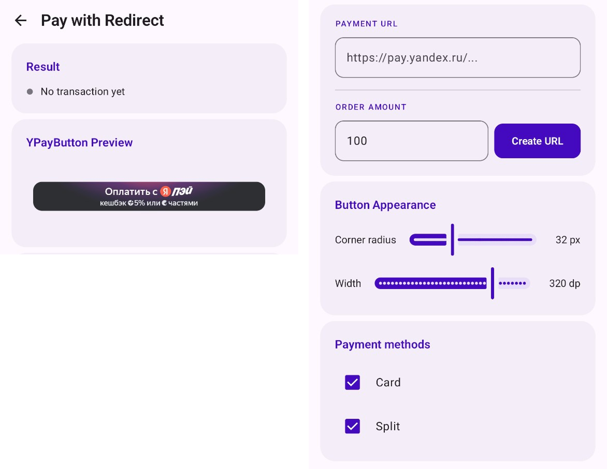
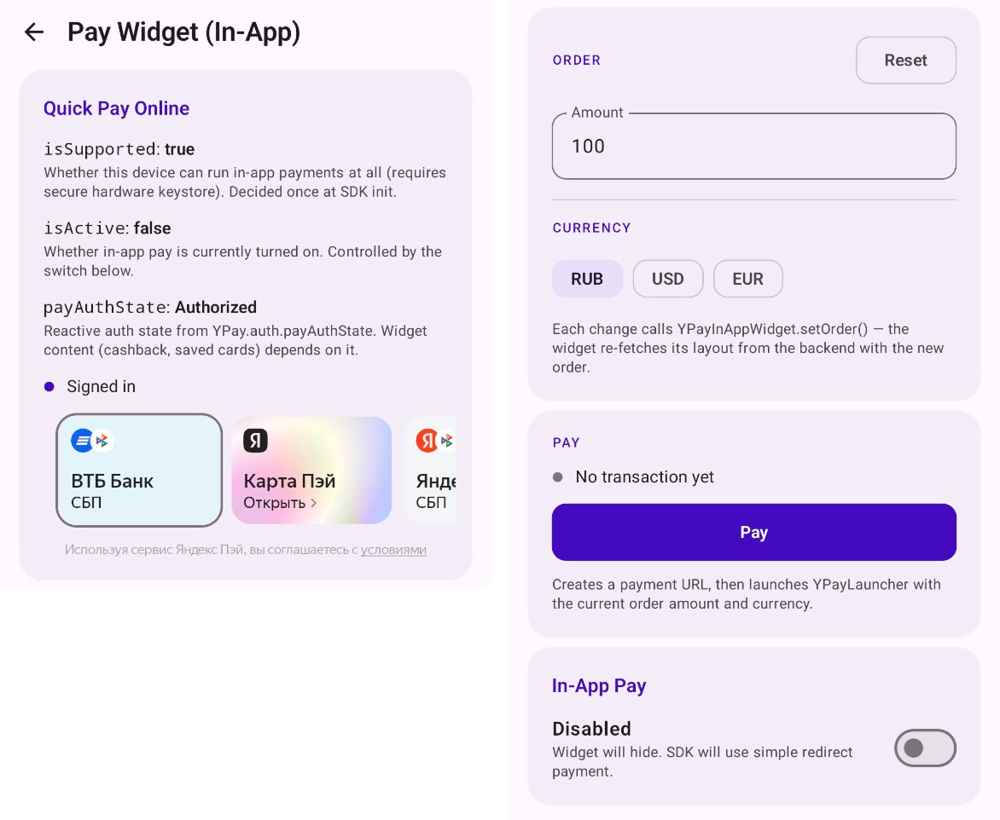
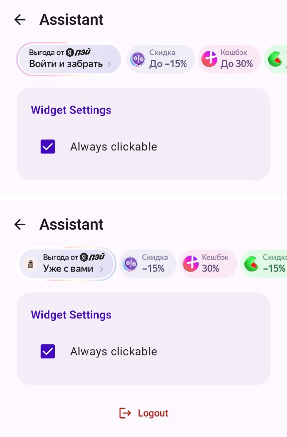
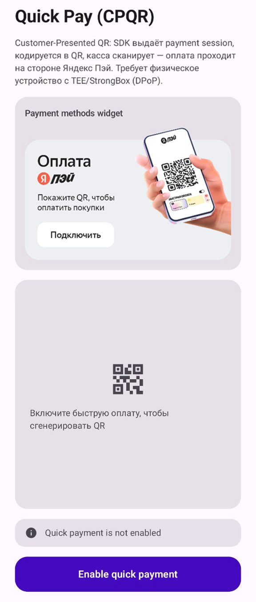
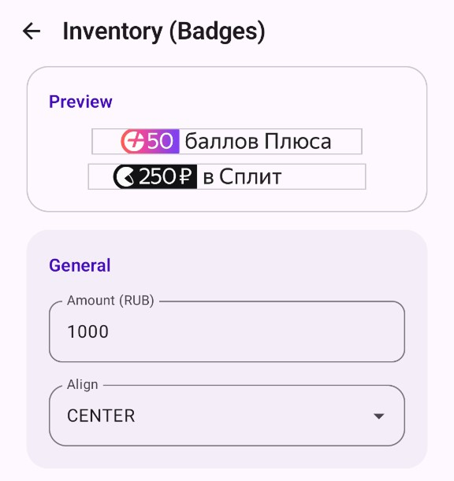

# Yandex Pay Kit Android Sample

Демо-приложение для [Yandex Pay Kit Android SDK](https://pay.yandex.ru/docs/) — модульного SDK для оплаты и сервисов выгодной покупки.

Yandex Pay Kit предоставляет готовые компоненты для:

- **Авторизации** через Яндекс ID
- **Оплаты** (отображение карт и проведение операций)
- **Виджетов выгод** (отображение скидок и кешбэка)
- **QR-платежей** (быстрая оплата через QR)
- **Бейджей** (кешбэк, сплит-платежи)

## Содержание

- [Требования](#требования)
- [Конфигурация](#конфигурация)
- [Запуск](#запуск)
- [Обзор модулей](#обзор-модулей)
  - [Авторизация (AuthScreen)](#авторизация-authscreen)
  - [Оплата (PayRedirectScreen)](#оплата-payredirectscreen)
  - [Пэй виджет (PayWidgetScreen)](#пэй-виджет-paywidgetscreen)
  - [Виджет выгод и ассистент (AssistantScreen)](#виджет-выгод-и-ассистент-assistantscreen)
  - [Быстрая оплата с QR (CPQRScreen)](#быстрая-оплата-с-qr-cpqrscreen)
  - [Бейджи (InventoryScreen)](#бейджи-inventoryscreen)
- [Частые проблемы](#частые-проблемы)

## Требования

- Android API 26+ (Android 8.0)
- Kotlin 2.0+
- Android Studio (AGP 9.0.1)

## Конфигурация

В `app/build.gradle.kts` уже настроены тестовые значения:

- `YANDEX_CLIENT_ID = b8f475015d0640fd8b870b5838e2e623`
- `YANDEX_PAY_CLIENT_ID = b8f475015d0640fd8b870b5838e2e623`
- `MERCHANT_ID = a5f49c84-0baa-41e1-814f-6f99746a6987`

Эти параметры пробрасываются в манифест и используются при инициализации SDK.

[Документация: получение идентификаторов](https://pay.yandex.ru/docs/ru/custom/yandex-pay-kit/auth/android/#shag-1-poluchite-identifikatory)

## Запуск

Откройте проект в Android Studio и запустите модуль `app` на **физическом устройстве**.

> [!WARNING]
> **Эмулятор не поддерживается**
> SDK использует DPoP-аутентификацию, которая требует защищённого аппаратного хранилища ключей (TEE / StrongBox). На эмуляторах это оборудование отсутствует, авторизация завершится ошибкой. Некоторые виджеты будут работать в неавторизованном состоянии.

## Обзор модулей

### Авторизация (AuthScreen)

Отдельный процесс Yandex ID-авторизации (`YPay.auth.getAuthContract()`). На `YPayAuthResult.Success` возвращается merchant token — пример того, как сторона мерчанта получает токен для авторизации пользователя на своём бэкенде.

Для авторизации можно использовать любой Яндекс ID аккаунт. В этом процессе демонстрируется **двойная авторизация** (авторизация открывается два раза подряд — это необходимо для аутентификации пользователя во внутреннем контуре Яндекс Пэй).

Авторизация сквозная между всеми компонентами — залогинившись в одном процессе, вы автоматически логинитесь во всех виджетах.

[Документация: двойная авторизация](https://pay.yandex.ru/docs/ru/custom/yandex-pay-kit/auth/)

[Документация: интеграция авторизации](https://pay.yandex.ru/docs/ru/custom/yandex-pay-kit/auth/android/)

[Документация: миграция с LoginSDK](https://pay.yandex.ru/docs/ru/custom/yandex-pay-kit/auth/android/auth-migration)

---

### Оплата (PayRedirectScreen)

SDK позволяет добавить в приложение оплату по платежной ссылке и кнопку с поддержкой разных видов оплаты.

Для работы кнопки оплаты нужно нажать "Create url" — после этого ссылка отобразится в поле **Payment Url** и будет использоваться для перехода в кнопке "Оплатить с Пэй".

[Документация: подключение оплаты по платежной ссылке](https://pay.yandex.ru/docs/ru/custom/yandex-pay-kit/redirect/android/)

---

### Пэй виджет (PayWidgetScreen)

Добавляет в приложение виджет (платежные методы и состояние авторизации) для сценария быстрой оплаты без редиректа. Сам виджет не запускает и не проводит оплату — он только участвует в UI и условиях in-app: фактическое списание инициирует ваш код через модуль YandexPayWithRedirect.

В примере виджет обновляется через `YPayInAppWidget.setOrder(PayOrder)`: при изменении суммы или валюты приложение передает в SDK актуальный заказ, а виджет заново получает с бэкенда Яндекс Пэй персонализированное отображение — доступные способы оплаты, кешбэк и авторизацию.

Кнопка **Pay** под виджетом демонстрирует подключение оплаты. Приложение создает платежную ссылку на стороне мерчанта, затем передает ее в `YPayLauncher` через `PaymentData(paymentUrl)`.

Состояние виджета и авторизации отслеживается реактивно: `YPay.auth.payAuthState` показывает авторизацию пользователя, `YPay.payInApp.isActive` — включен ли in-app сценарий, а одноразовые события `YPay.auth.authResultEvents` выводятся в snackbar.

> [!WARNING]
> **Подключение оплаты**
> Чтобы после отображения виджета можно было запустить оплату, дополнительно подключите модуль YandexPayWithRedirect. Без него виджет в UI есть, но платежную сессию открыть не получится — ее запускает только API payWithRedirect (форма или кнопка).

[Документация: Пэй виджет](https://pay.yandex.ru/docs/ru/custom/yandex-pay-kit/pay-widget/android/)

---

### Виджет выгод и ассистент (AssistantScreen)

Виджет выгод (бенефитов), который поддерживает авторизацию пользователя. По клику отображает экран авторизации либо экран ассистента, который рассказывает пользователю про скидки и бонусы.

Чекбокс Widget settings демонстрирует работу параметра `Clickability`, который определяет вид и кликабельность виджета всегда либо только в авторизованном состоянии.

[Документация по интеграции виджета и его параметрах](https://pay.yandex.ru/docs/ru/custom/yandex-pay-kit/assistant/benefit-widget/android/)

---

### Быстрая оплата с QR (CPQRScreen)

QR‑код от Яндекс Пэй позволяет добавить в мобильное приложение быструю оплату в офлайн-точках. Пользователь один раз авторизуется, после чего может оплачивать покупки: приложение генерирует QR-код, который кассир сканирует на терминале.

Авторизуйтесь кнопкой "Подключить" и выберите карту, с которой хотите произвести списание. Нажмите "Refresh QR" для создания индивидуального QR-кода для оплаты.

[Документация: интеграция CPQR](https://pay.yandex.ru/docs/ru/custom/yandex-pay-kit/cp-qr/android/)

---

### Бейджи (InventoryScreen)

Визуализация 2 типов бейджей (всего библиотекой поддерживается 4 вида), с настройкой цвета и типа (подробный и компактный).

[Документация по интеграции и по всем типам бейджей](https://pay.yandex.ru/docs/ru/custom/yandex-pay-kit/inventory/android/)

## Частые проблемы

- **После авторизации приложение снова просит залогиниться**

    Так работает [двойная авторизация](https://pay.yandex.ru/docs/ru/custom/yandex-pay-kit/auth/#concept). Первый логин позволяет получить токен для контура Яндекс ID, который вы можете использовать для авторизации пользователя внутри вашего сервиса. Второй логин — для авторизации внутри контура Яндекс Пэй. Он позволяет работать с виджетами и оплатой. Подробнее и схема работы — [в документации](https://pay.yandex.ru/docs/ru/custom/yandex-pay-kit/auth/).

- **Не получается залогиниться на эмуляторе**

    Авторизация не поддерживает эмулятор, так как для обеспечения безопасности SDK использует DPoP-аутентификацию. Она требует [защищенного аппаратного хранилища ключей (TEE/Strongbox)](https://developer.android.com/privacy-and-security/keystore#StrongBoxKeyMint), который отсутствует на эмуляторах.

- **Получаю сообщение "Эмулятор не поддерживается", но у меня физическое устройство**

    На вашем устройстве отсутствует [защищенное аппаратное хранилище ключей](https://developer.android.com/privacy-and-security/keystore#StrongBoxKeyMint), такое устройство не поддерживается SDK. Попробуйте другое устройство.

- **Получаю ошибку 500 при попытке авторизации**

    Скорее всего, указаны некорректные значения или неверные скоупы у YANDEX_CLIENT_ID / YANDEX_PAY_CLIENT_ID. Для корректной работы сервиса нужно указать специальные скоупы, которые можно получить только у команды поддержки при интеграции SDK в ваше приложение. Если у вас нет client_id, выданного командой Пэй, воспользуйтесь параметрами, зашитыми в репозитории.

    Для дебага также рекомендуется воспользоваться Network Inspector или Charles для проверки результатов запросов при авторизации или отображении виджетов.

- **Авторизация вроде бы прошла, но состояние виджетов не изменилось**

    Если вы меняли подпись приложения (собирали с keystore, отличным от того, что зашит в репозитории), авторизация перестанет работать, так как SHA256 указывается при настройке clientId. Пожалуйста, используйте `app/debug.keystore` для подписи демо-приложения.

    Также может помочь тестирование на устройстве, на которым не установлены другие приложения Яндекса – чтобы минимизировать риск проблем, связанных с разными версиями LoginSDK у разных приложений.
