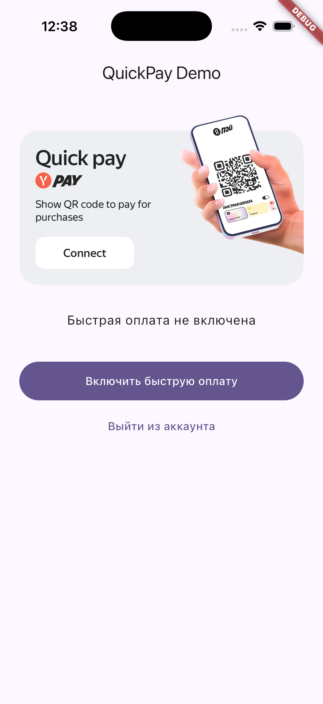

# Quick Pay — Flutter sample

Сэмпл интеграции **QuickPay** (быстрая офлайн-оплата по QR-коду, CP QR) во Flutter-приложении.
Это QuickPay-only демо, а не полный Yandex Pay Kit. Android- и iOS-части подставляют тестовые
идентификаторы; при необходимости их можно переопределить через `local.properties` (Android).

Официальная документация: [QuickPay для Flutter](https://pay.yandex.ru/docs/custom/quickpay/flutter/).

## Скриншот



## Что демонстрирует

- Инициализация SDK (`YPay.initialize`, `quickPayModule`, `YQuickPay`)
- Включение / отключение быстрой оплаты (enable / disable quick pay)
- Генерация платёжной сессии и QR-кода (session id + `qr_flutter`)
- Виджет платёжных методов (`YandexPaymentMethodsWidget`, через PlatformView)
- Обработка событий (`YQuickPaymentStateListener`): результат оплаты, истечение сессии, смена состояния
- Дружелюбная обработка ошибок SDK и выход из аккаунта (logout)

## Требования

- Flutter SDK (версия согласно `pubspec.yaml`).
- **Android:** API 24+ (Android 7.0), JDK 17.
- **iOS:** Xcode 16+, CocoaPods; сборка через `ios/Runner.xcworkspace`.

## Перед запуском

По умолчанию в `android/app/build.gradle.kts` уже подставлены тестовые **Client ID**, **merchant**
и окружение (**SANDBOX** — реальные списания не выполняются). Чтобы задать свои значения, скопируйте
`android/local.properties.example` в `android/local.properties` (файл не коммитится) и отредактируйте
ключи — см. комментарии в примере и
[документацию по OAuth для Android](https://pay.yandex.ru/docs/android-sdk/url-flow#create-oauth-app).

## Запуск

Из корня сэмпла:

```bash
flutter pub get
flutter run
```

Для iOS перед первым запуском поставьте поды:

```bash
cd ios && pod install && cd -
flutter run
```

Сборка только Android: `flutter build apk` (или `appbundle`).

> ⚠️ **Запускайте только на физическом устройстве.** SDK использует DPoP-аутентификацию с
> аппаратным хранилищем ключей (TEE/StrongBox / Secure Enclave). На эмуляторах и симуляторах эта
> функция недоступна — инициализация завершится ошибкой `Could not get jwk`.

## См. также

- [Android-сэмпл](../android/README.md)
- [iOS-сэмпл](../ios/README.md)
